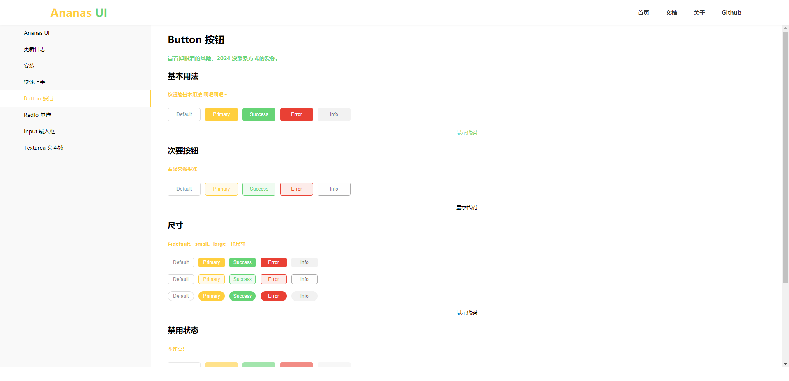

<p align="center">
<a href="https://github.com/zjxzjw/Ananas-UI">
  
</a>
</p>

<p align="center">
<a href="https://www.npmjs.com/package/ananas-ui" target="__blank"></a>
<a href="https://www.npmjs.com/package/ananas-ui" target="__blank"></a>
<a href="https://zjxzjw.github.io/Ananas-UI/" target="__blank"></a>
<a href="https://github.com/zjxzjw/Ananas-UI" target="__blank"></a>
</p>

# 介绍

Ananas UI是一个用于Vue3的轻量UI组件库

> 颜色有点像热带水果

## 安装教程

```bash
# 使用npm安装
npm i ananas-ui

# 使用yarn安装
yarn add ananas-ui

# 使用pnpm安装
pnpm add ananas-ui
```

## 使用教程

```javascript
import { createApp } from 'vue'
import App from './App.vue'
import AnanasUI from 'ananas-ui'

const app = createApp(App)
app.use(AnanasUI)
app.mount('#app')
```

## 文档

[Ananas UI 文档](https://zjxzjw.github.io/Ananas-UI/)

## 演示



## 许可证

[MIT](./LICENSE)
